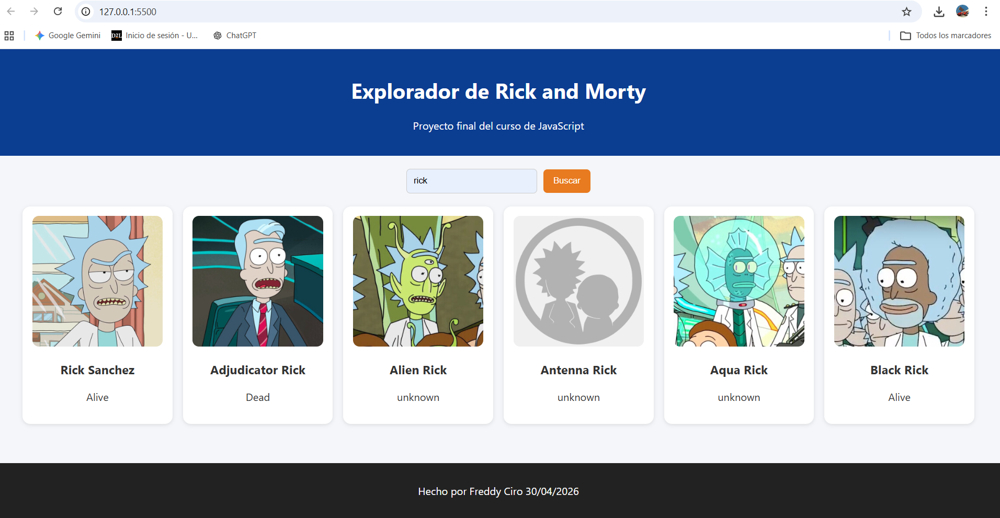

# Proyecto Final API - Rick and Morty

## 📌 Descripción
Aplicación web que consume la API de Rick and Morty para mostrar personajes.

## 🚀 Tecnologías
- HTML
- CSS
- JavaScript
- Fetch API
- Async/Await

## 🌐 API
https://rickandmortyapi.com/

## ⚙️ Funcionalidades
- Buscar personajes
- Mostrar resultados en tarjetas
- Manejo de errores
- Ver detalle al hacer clic

## 📸 Captura de pantalla
